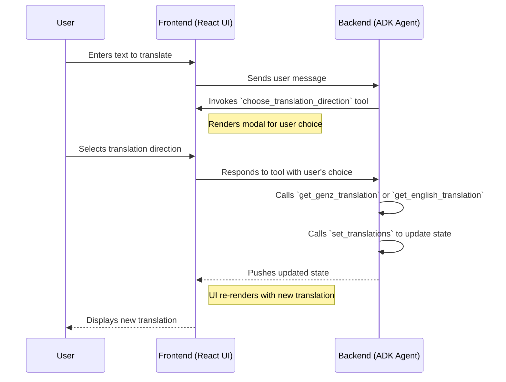

# Gen-Z slang AI Translator with Copilotkit, ADK and RAG Grounding.

This document provides a comprehensive analysis of the CopilotKit ADK Starter project, a powerful example of how to build a modern, AI-powered application with a Next.js frontend and a Python FastAPI backend.

## Prerequisites

- Node.js 18+
- Python 3.12+
- Google Makersuite API Key (for the ADK agent) (see https://makersuite.google.com/app/apikey)
- Any of the following package managers:
  - pnpm (recommended)
  - npm
  - yarn
  - bun

> **Note:** This repository ignores lock files (package-lock.json, yarn.lock, pnpm-lock.yaml, bun.lockb) to avoid conflicts between different package managers. Each developer should generate their own lock file using their preferred package manager. After that, make sure to delete it from the .gitignore.

## Getting Started

1. Install dependencies using your preferred package manager:
```bash
# Using pnpm (recommended)
pnpm install

# Using npm
npm install

# Using yarn
yarn install

# Using bun
bun install
```

2. Install Python dependencies for the ADK agent:
```bash
# Using pnpm
pnpm install:agent

# Using npm
npm run install:agent

# Using yarn
yarn install:agent

# Using bun
bun run install:agent
```

> **Note:** This will automatically setup a `.venv` (virtual environment) inside the `agent` directory.
>
> To activate the virtual environment manually, you can run:
> ```bash
> source agent/.venv/bin/activate
> ```


3. Set up your Google API key:
```bash
export GOOGLE_API_KEY="your-google-api-key-here"
```

4. Start the development server:
```bash
# Using pnpm
pnpm dev

# Using npm
npm run dev

# Using yarn
yarn dev

# Using bun
bun run dev
```

This will start both the UI and agent servers concurrently.

## Available Scripts
The following scripts can also be run using your preferred package manager:
- `dev` - Starts both UI and agent servers in development mode
- `dev:debug` - Starts development servers with debug logging enabled
- `dev:ui` - Starts only the Next.js UI server
- `dev:agent` - Starts only the ADK agent server
- `build` - Builds the Next.js application for production
- `start` - Starts the production server
- `lint` - Runs ESLint for code linting
- `install:agent` - Installs Python dependencies for the agent


## 1. Project Architecture

The project is thoughtfully structured to separate the user interface from the AI agent's logic. This separation of concerns is a key best practice in software development, and it's particularly important in AI applications where the agent's capabilities may evolve independently of the UI.

### 1.1. Frontend: Next.js and CopilotKit

The frontend is a [Next.js](https://nextjs.org/) application, a popular React framework for building server-rendered and statically generated web applications. The UI is built using [React](https://react.dev/) and styled with [Tailwind CSS](https://tailwindcss.com/).

The most important aspect of the frontend is its use of [CopilotKit](https://www.copilotkit.ai/), a library that simplifies the process of building AI-powered user interfaces. CopilotKit provides a set of hooks and components that make it easy to:

*   **Manage shared state:** The `useCoAgent` hook allows the frontend to share state with the backend agent, enabling a seamless flow of information between the two.
*   **Define frontend actions:** The `useCopilotAction` hook allows the frontend to define actions that can be invoked by the agent. This is a powerful feature that enables the agent to interact with the UI and even trigger human-in-the-loop workflows.

### 1.2. Backend: Python, FastAPI, and the Google Agent Development Kit (ADK)

The backend is a Python application built with [FastAPI](https://fastapi.tiangolo.com/), a modern, high-performance web framework for building APIs. The core of the backend is the AI agent, which is built using the [Google Agent Development Kit (ADK)](https://developers.google.com/adk).

The ADK provides a framework for building and managing AI agents. In this project, it's used to:

*   **Define the agent's tools:** The agent is equipped with a set of tools that it can use to perform tasks, such as translating text.
*   **Manage the agent's lifecycle:** The ADK handles the complexities of running the agent, including managing its state and interacting with the language model.
*   **Expose the agent as an API:** The ADK makes it easy to expose the agent as a FastAPI endpoint, which allows the frontend to communicate with it.

## 2. Frontend Deep Dive

The frontend of the CopilotKit ADK Starter is a testament to the power of modern web development and the ease of integrating AI with CopilotKit. Let's break down the key components and concepts.

### 2.1. Shared State with `useCoAgent`

The `useCoAgent` hook is the bridge between the frontend and the backend agent. It allows the two to share a common state, which is essential for building a cohesive user experience. In this project, the shared state is used to store the list of translations.

When the agent adds a new translation, it updates the shared state. The frontend, which is subscribed to changes in the shared state, automatically re-renders to display the new translation. This creates a real-time, dynamic user experience without the need for complex state management logic.

### 2.2. Frontend Actions with `useCopilotAction`

The `useCopilotAction` hook is another powerful feature of CopilotKit. It allows the frontend to define actions that can be invoked by the agent. This is a crucial feature for building interactive AI applications, as it allows the agent to go beyond simply providing text-based responses.

In this project, `useCopilotAction` is used to implement several frontend actions, including:

*   **`setThemeColor`:** This action allows the agent to change the theme color of the application. This is a simple but effective demonstration of how the agent can interact with the UI.
*   **`choose_translation_direction`:** This is the most interesting action in the project. It allows the agent to prompt the user to choose the direction of a translation (English to Gen-Z or Gen-Z to English). This is a perfect example of how to use CopilotKit to build human-in-the-loop UI features.

### 2.3. Human-in-the-Loop UI

The `choose_translation_direction` action is a great example of a human-in-the-loop UI. When the agent needs to translate a piece of text, it doesn't just guess the direction. Instead, it invokes the `choose_translation_direction` action, which renders a modal on the frontend.

The modal prompts the user to choose the translation direction. Once the user makes a selection, the frontend sends the response back to the agent, which then proceeds with the translation. This is a powerful pattern that can be used to build a wide range of interactive AI applications.

## 3. Backend Deep Dive

The backend of the CopilotKit ADK Starter is where the AI magic happens. It's a Python application built with FastAPI and the Google Agent Development Kit (ADK).

### 3.1. FastAPI: The Foundation

[FastAPI](https://fastapi.tiangolo.com/) is a modern, high-performance web framework for building APIs with Python. It's a great choice for this project because it's fast, easy to use, and has excellent support for asynchronous programming.

In this project, FastAPI is used to create a simple web server that exposes the ADK agent as an API endpoint. This allows the frontend to communicate with the agent using standard HTTP requests.

### 3.2. Google Agent Development Kit (ADK): The Brains

The [Google Agent Development Kit (ADK)](https://developers.google.com/adk) is the core of the backend. It's a framework for building and managing AI agents. In this project, it's used to create the `TranslationsAgent`, a powerful AI agent that can translate text.

The ADK provides a number of features that make it easy to build sophisticated AI agents, including:

*   **Tool management:** The ADK makes it easy to define and manage the agent's tools. In this project, the agent has tools for translating text, and more.
*   **State management:** The ADK provides a simple way to manage the agent's state. In this project, the agent's state is used to store the list of translations.
*   **Language model integration:** The ADK handles the complexities of interacting with the language model, so you can focus on building the agent's logic.

### 3.3. The Agent's Tools

The `TranslationsAgent` is equipped with a set of tools that it can use to perform tasks. These tools are the key to the agent's functionality.

*   **`get_genz_translation` and `get_english_translation`:** These tools are used to translate text between English and Gen-Z slang. They are implemented using a `GenZTranslator` class, which uses a Retrieval-Augmented Generation (RAG) pattern with ChromaDB to provide the translations.
*   **`set_translations`:** This tool is used to update the list of translations in the shared state.
*   **`choose_translation_direction`:** This tool is used to trigger the human-in-the-loop UI on the frontend.

## 4. Data Flow: Tying It All Together

Now that we've looked at the frontend and backend in detail, let's trace the flow of data through the application.

1.  **User Input:** The user types a message into the chat interface on the frontend.
2.  **Frontend to Backend:** The frontend sends the user's message to the backend API endpoint.
3.  **ADK Agent:** The ADK agent receives the message and decides which tool to use.
4.  **Human-in-the-Loop:** If the agent needs to translate text, it invokes the `choose_translation_direction` tool. This sends a request to the frontend to render the translation direction modal.
5.  **User Interaction:** The user selects the translation direction.
6.  **Frontend to Backend:** The frontend sends the user's selection back to the agent.
7.  **Translation:** The agent uses the appropriate translation tool to translate the text.
8.  **State Update:** The agent uses the `set_translations` tool to update the shared state with the new translation.
9.  **Backend to Frontend:** The backend sends the updated state to the frontend.
10. **UI Update:** The frontend re-renders to display the new translation.

This is a simplified overview, but it illustrates the key concepts of how the frontend and backend work together to create a seamless and interactive user experience.


